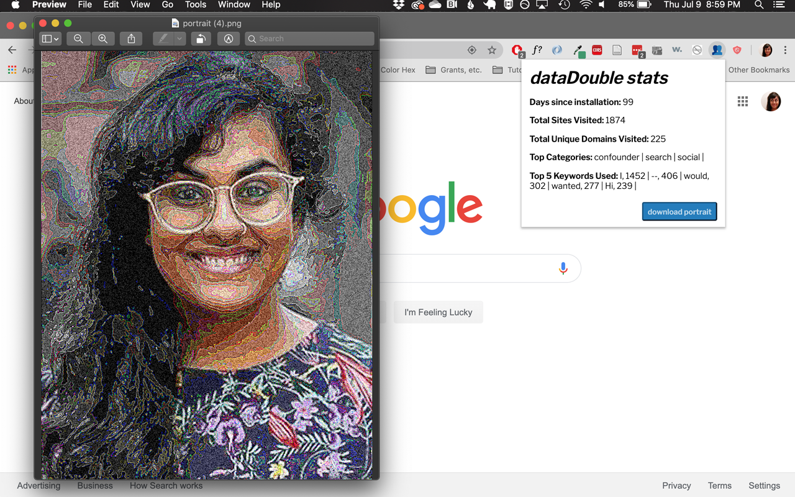

# dataDouble
### a project by roopa vasudevan

*dataDouble* (2018-present) is a project designed to illuminate the ways in which our identities are flattened and reduced by data collection. Finding inspiration in the idea of the “data clone”, a likeness developed out of the digital traces that we (voluntarily or involuntarily) leave behind in our day to day interactions with technology, the project seeks to translate an individual user’s browsing data into a visual interpretation of how they are seen in the eyes of those extracting their information.    

The core of *dataDouble* consists of a web browser extension developed for both Google Chrome and Mozilla Firefox. The extension tracks the URLs of all of the websites a user visits while it is running, as well as any text typed into the body of a website, including search engine queries, social media updates, and composed emails.

Through the collection of a user’s information, the extension then modifies and manipulates a provided photograph of the user to reflect the data clone that is sent to the entities collecting this information. Over time, the image, while still somewhat recognizable as a portrait of the individual user, becomes a warped and alternate representation of the self—the reduced, flattened version of the self that is used as a basis for the ostensibly personalized and extremely segmented experience that users have on the Internet today.

 

For more information, please visit the [project page](https://rouxpz.com/data-double) on my website. To participate in this project, please visit [this signup page](https://bit.ly/2Itmc3g).

*Special thanks to [Wendy Chun](https://www.sfu.ca/communication/team/faculty/wendy-chun.html), [Jessa Lingel](https://www.asc.upenn.edu/people/faculty/jessa-lingel-phd), Haverford College and the [Philadelphia Area Creative Collaboratives](https://collaboratives.haverford.edu/surveillance-states/), and the members of the Critical Data Studies (F18) and Doing Internet Studies (S19) courses at the Annenberg School for Communication at the University of Pennsylvania.*
